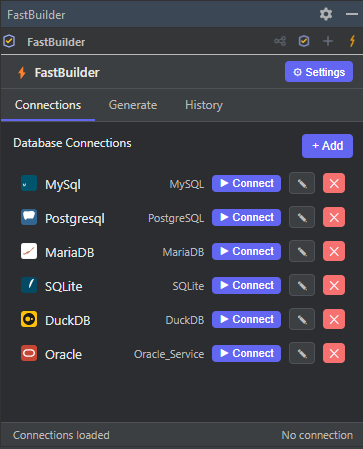
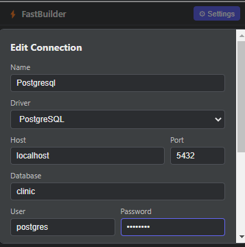
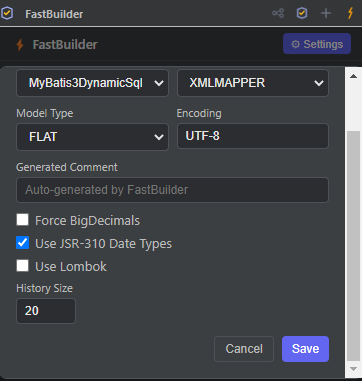

# FastORM Builder

> **The fastest way to go from database schema to production-ready ORM code.**

---

## 🚀 What is FastORM Builder?

FastORM Builder is a JetBrains IDE plugin that eliminates the tedious boilerplate of writing ORM entities by hand. Connect to your database, pick your tables, choose your framework — and get perfectly structured code in seconds.

**No more copy-pasting column names. No more typos in annotations. No more wasted time.**

Works in **all JetBrains IDEs** — IntelliJ IDEA, WebStorm, PhpStorm, PyCharm, and more.
Powered by a modern embedded web UI (JCEF) — everything happens in a single, fluid interface with no popup dialogs.

---

## 🎯 One Plugin, Twelve Frameworks

### ☕ Java
| Framework | What you get |
|-----------|-------------|
| **MyBatis** | Model classes + Mapper interfaces + XML with full SQL |
| **JPA** | `@Entity` classes with `@Table`, `@Column`, relationships, Lombok |
| **Hibernate** | Annotated entities or HBM XML + `hibernate.cfg.xml` |
| **YORM** | Java Records — zero annotations, pure convention |

### ⬡ JavaScript / TypeScript
| Framework | What you get |
|-----------|-------------|
| **Sequelize** | Model definitions with DataTypes + index file |
| **Knex.js** | Migration file with createTable / dropTable |
| **Prisma** | Complete `schema.prisma` with models and datasource |
| **TypeORM** | Entity classes with decorators |
| **Bookshelf.js** | Model with tableName and idAttribute |
| **Waterline** | Model with identity and typed attributes |
| **Objection.js** | Model classes with jsonSchema validation |
| **MikroORM** | Entity classes with @Entity, @PrimaryKey, @Property |

---

## 📸 Screenshots

### Connections Manager
Manage multiple database connections with one-click connect. Supports MySQL, PostgreSQL, MariaDB, Oracle, SQLite, and DuckDB.



### Connection Editor
Intuitive connection setup with driver auto-detection and test button.



### Generate Panel
Browse schemas, select tables, choose your ORM framework, and generate — all in one view.


### Settings
Fine-tune generation defaults: naming patterns, Lombok, annotations, runtime options.



### Generation History
Full audit trail of every generation — what was generated, when, with which settings.


---

## ✨ Key Features

- ⚡ **One-click generation** — Select tables → Generate. Done.
- 🌐 **Modern web UI** — Fully embedded JCEF interface, no legacy Swing dialogs
- 🔄 **12 ORM frameworks** — 4 Java + 8 JavaScript/TypeScript
- 🏗️ **Relationship detection** — Auto-generates `@ManyToOne` / `@OneToMany` from foreign keys
- 📦 **Lombok support** — Optional `@Data` / `@Builder` for JPA and Hibernate entities
- 🗄️ **6 databases** — MySQL, PostgreSQL, MariaDB, Oracle, SQLite, DuckDB
- 📋 **Copy as Executable SQL** — Paste runnable SQL from MyBatis log output
- 🕐 **Generation history** — Track and reproduce past generations
- 🔌 **Multiple connections** — Switch between dev, staging, prod databases instantly
- 🌍 **All JetBrains IDEs** — Works in WebStorm, PhpStorm, PyCharm, and more
- ⚠️ **Overwrite protection** — Warns before overwriting existing files

---

## 🏁 Getting Started

```
1. Install FastORM Builder from JetBrains Marketplace
2. Open the FastORM Builder tool window (left sidebar)
3. Add a database connection → Test → Connect
4. Select Java or JS, choose your ORM from the dropdown
5. For JS: pick JS or TS output format
6. Select tables and click ⚡ Generate — done!
```

---

## 📋 Requirements

- Any JetBrains IDE 2024.1+ (IntelliJ IDEA, WebStorm, PhpStorm, PyCharm, etc.)
- Java 17+
- JetBrains Runtime with JCEF (included by default in all standard JetBrains distributions)

---

## 🏷️ Tags

`orm` · `code-generator` · `mybatis` · `jpa` · `hibernate` · `yorm` · `sequelize` · `knex` · `prisma` · `typeorm` · `mikroorm` · `database` · `entity-generator` · `java` · `javascript` · `typescript`

---

## Plugin Metadata

| Field | Value |
|-------|-------|
| **Name** | FastORM Builder |
| **ID** | org.fastormbuilder.plugin |
| **Version** | 0.9.0 |
| **Category** | Code tools |
| **Pricing** | Free |
| **Compatibility** | All JetBrains IDEs 2024.1+ |

---

## HTML Description (for JetBrains Marketplace upload)

```html
<h2>⚡ FastORM Builder — Multi-ORM Code Generator</h2>

<p><b>The fastest way to go from database schema to production-ready ORM code.</b></p>

<p>Connect to your database, select tables, choose your ORM framework, and generate
perfectly structured code in seconds. Supports <b>12 ORM frameworks</b> across Java and JavaScript/TypeScript.</p>

<p>Works in <b>all JetBrains IDEs</b> — IntelliJ IDEA, WebStorm, PhpStorm, PyCharm, and more.
Powered by a modern embedded web UI — everything happens in a single, fluid interface.</p>

<h3>Supported Frameworks</h3>
<p><b>Java:</b> MyBatis · JPA · Hibernate · YORM</p>
<p><b>JavaScript/TypeScript:</b> Sequelize · Knex.js · Prisma · TypeORM · Bookshelf.js · Waterline · Objection.js · MikroORM</p>

<h3>Supported Databases</h3>
<p>MySQL · PostgreSQL · MariaDB · Oracle · SQLite · DuckDB</p>

<h3>Key Features</h3>
<ul>
  <li>⚡ <b>One-click generation</b> from database tables to complete ORM artifacts</li>
  <li>🌐 <b>Modern web UI</b> — fully embedded JCEF interface, no legacy dialogs</li>
  <li>🔄 <b>12 ORM frameworks</b>: 4 Java + 8 JavaScript/TypeScript</li>
  <li>🏗️ <b>Relationship mapping</b>: auto-detect FKs → @ManyToOne / @OneToMany</li>
  <li>📦 <b>Lombok support</b>: optional @Data/@Builder for entities</li>
  <li>⚠️ <b>Overwrite protection</b>: warns before overwriting existing files</li>
  <li>📋 <b>Copy as Executable SQL</b> from MyBatis log output</li>
  <li>🕐 <b>Generation history</b>: full audit trail with reproduce capability</li>
  <li>🔌 <b>Multiple connections</b>: switch between databases instantly</li>
  <li>🌍 <b>All JetBrains IDEs</b>: works in WebStorm, PhpStorm, PyCharm, and more</li>
</ul>

<h3>Getting Started</h3>
<ol>
  <li>Open the <b>FastORM Builder</b> tool window</li>
  <li>Add a database connection and click Connect</li>
  <li>Select Java or JS, choose your ORM framework</li>
  <li>Select tables and click <b>Generate</b> — done!</li>
</ol>

<h3>Requirements</h3>
<p>Any JetBrains IDE 2024.1+ · Java 17+ · JCEF (included by default)</p>
```
